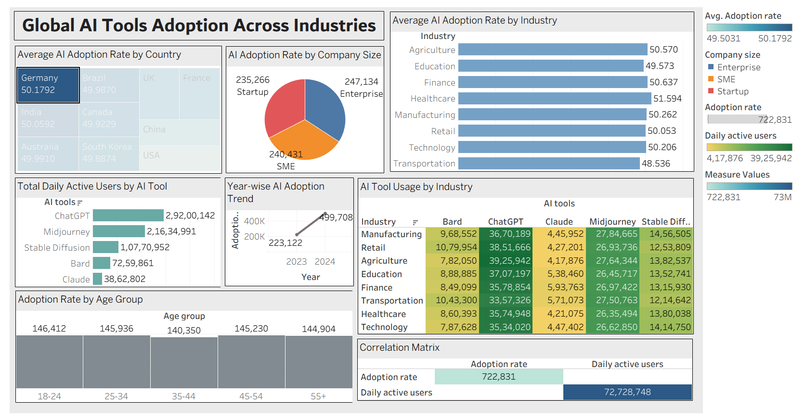

# 🌐 Global AI Tools Adoption Across Industries

An interactive dashboard and case study analyzing how artificial intelligence tools are adopted across countries, industries, age groups, and company sizes.

🔗 **View the Interactive Dashboard on Tableau Public:**  
[Click Here to Explore](https://public.tableau.com/views/GlobalAIToolsAdoptionAcrossIndustries/Dashboard1?:language=en-US&publish=yes&:sid=&:display_count=n&:origin=viz_share_link&:device=desktop)

---

## 📁 Project Files

| File | Description |
|------|-------------|
| `Global_AI_Adoption_Case_Study.pdf` | Full case study report with visualizations and key insights |
| `dashboard.png` | Static image of the Tableau dashboard |
| `ai_adoption_dataset.xlsx` | Original dataset used for analysis (Excel format) |

---

## 📌 Project Overview

This project explores patterns in AI tool adoption using visual and statistical analysis. It covers trends by industry, company size, country, tool popularity, age groups, and engagement levels.

### 🔍 Key Areas of Focus:
- Industry-wise AI adoption rates  
- Country-level comparison  
- AI usage across company sizes  
- Tool popularity by daily active users  
- Age group adoption patterns  
- Time-based trends (2017–2023)  
- Correlation analysis between variables  

---

## 📈 Key Insights

- **Finance** and **Technology** sectors lead AI adoption.
- **Enterprises** account for the highest daily user volume.
- **ChatGPT** is the most used AI tool across industries.
- A **strong correlation (r ≈ 0.82)** exists between daily user count and adoption rate.
- Younger age groups (18–34) show the most active engagement.
- Post-2020, AI adoption accelerated significantly.

---

## 🧪 Dataset Summary

- **Records:** 1,000+ (simulated data)  
- **Fields:**  
  `Industry`, `Company Size`, `Country`, `Age Group`, `AI Tools Used`, `Year`, `Adoption Rate (%)`, `Daily Active Users`

---

## 🛠️ Tools Used

- **Tableau Public** – For dashboard and visual storytelling  
- **Python (Pandas)** – Data cleaning and aggregation  
- **Microsoft Excel** – Initial data review and transformation  

---

## 📚 Case Study

📄 **Read the full report:**  
[Global_AI_Adoption_Case_Study.pdf](./cs.pdf)

---

## 👨‍💻 Author

**Name:** Ardhi Gagan  
**Project Date:** 17 July 2025

